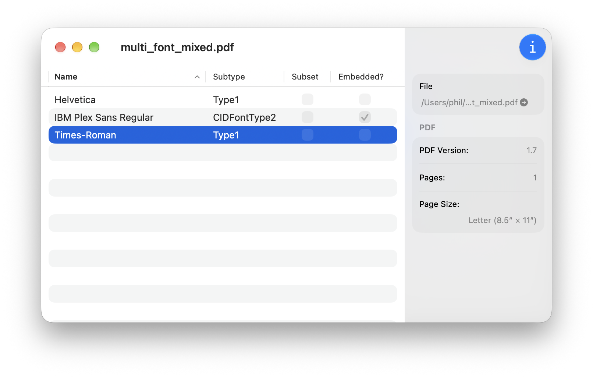
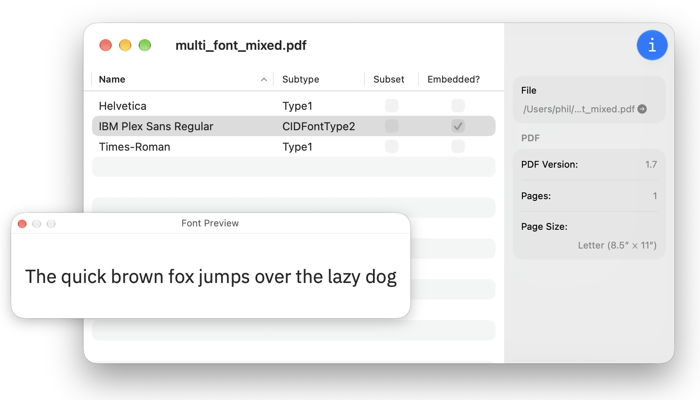
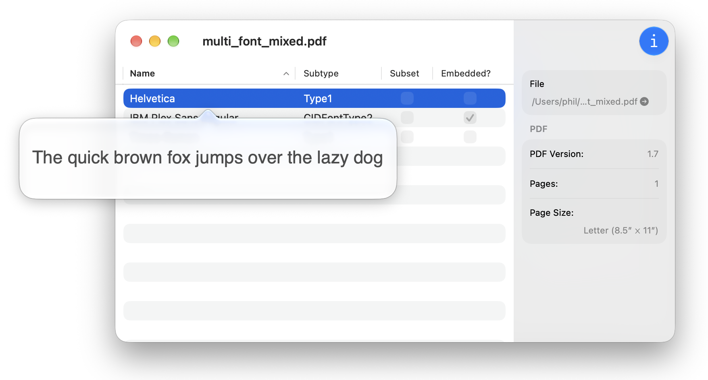

# PDF Info

PDF Info is a small, native macOS app for inspecting PDF fonts and metadata.

Double clicking on a font opens a preview window:

Pressing space shows a quick look preview of the font:

