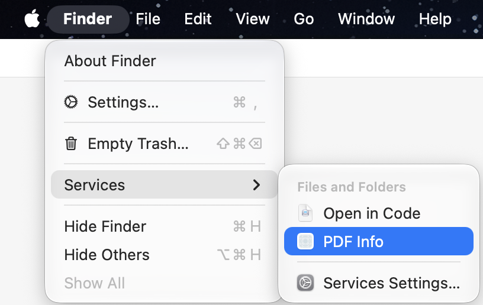
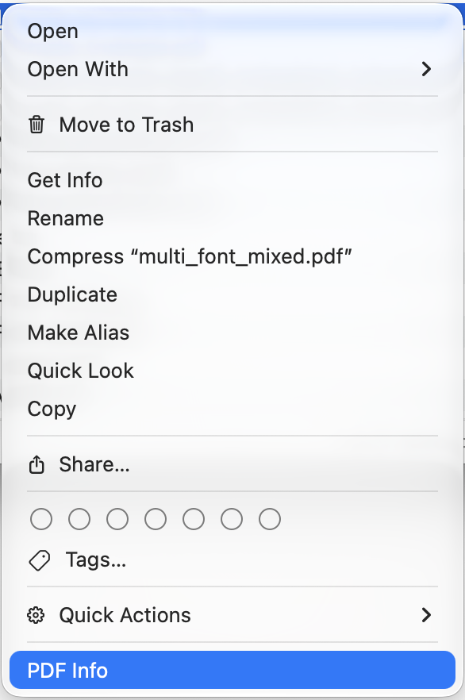

# PDF Info

PDF Info is a small, native macOS app for inspecting PDF fonts and metadata.

It allows you to preview the fonts (if they're installed) by pressing Space or
double clicking.


The app also installs a service for PDF files that shows in Finder's "Services"
menu and in the Finder context menu:




## Installation

1. From GitHub: you can download a disk image (`.dmg` file) with the latest
   version from [GitHub](https://github.com/philipbel/PDFInfo/releases).
2. To install via Homebrew, first add the [philipbel/tap](https://github.com/philipbel/homebrew-tap) tap
   ```bash
   brew tap philipbel/tap
   brew trust philipbel/tap
   ```

   Then install the cask:
   ```bash
   brew install --cask pdfinfo
   ```
